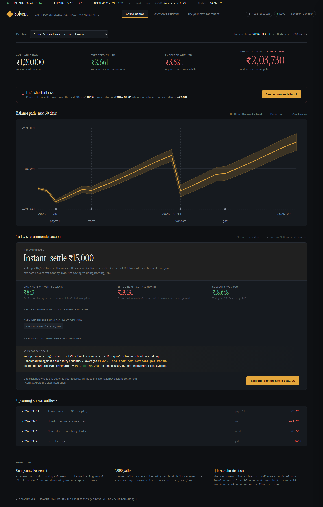
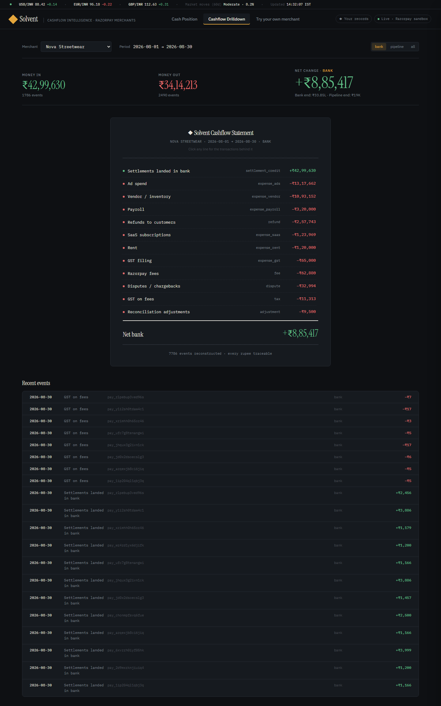
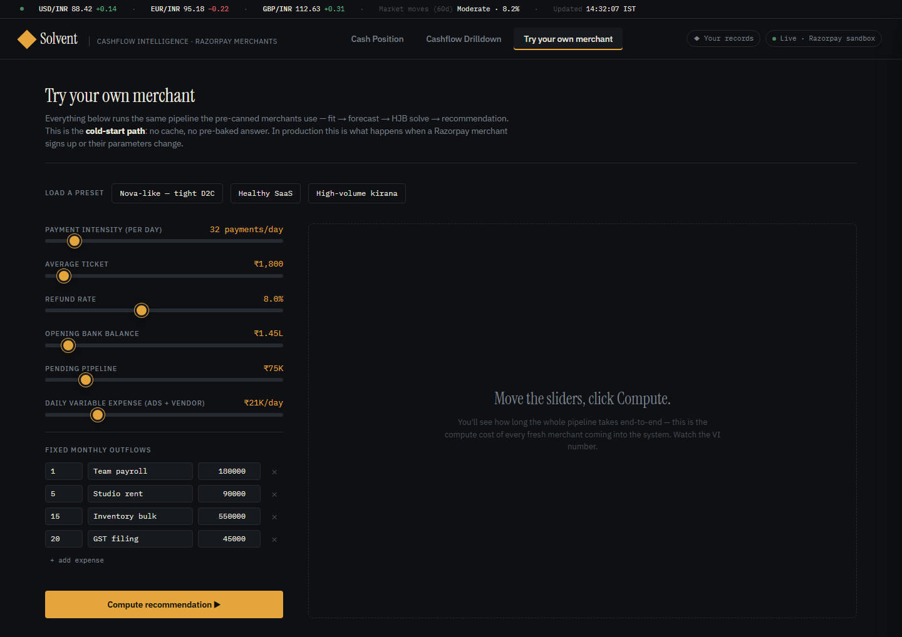

# Solvent — Autonomous Cashflow Agent for Any Payment Gateway

**Submission for the [Razorpay AI Buildathon 2026](https://razorpay.com/buildathon/), Track 04 (AI Finance Controller).**

Solvent is an autonomous finance-ops agent. It observes a merchant's cash position through a payment-gateway adapter, forecasts the balance path distributionally, decides the optimal action via Hamilton-Jacobi-Bellman value iteration, gates the action against user-set policy, executes it via the gateway API, and reports to an append-only audit trail.

**Gateway-agnostic**: RazorpayAdapter ships today; StripeAdapter is a documented skeleton; adding Cashfree/Adyen/PayPal is a single new adapter file.

**Modes**: off · advisory · semi-auto · full-auto — with per-merchant policy caps (min cash floor, max IS per 24h, allow credit draws, quiet hours).

---

## Screenshots

### Cash Position — the merchant's daily dashboard

The default view. KPI tiles for available now / expected in / expected out / projected minimum, followed by the shortfall-risk banner, the 30-day balance-path fan chart with 10–90 percentile band, and the optimizer's recommendation broken down as **optimal-with-Solvent (₹843)** vs **never-act-all-month (₹19,491)** vs **savings (₹18,648)**. Upcoming known outflows and the under-the-hood callout are below.



### Cashflow Drilldown — every rupee traceable

A receipt-style breakdown of every `CashflowEvent` in the period, grouped by category with `source_id` traceability. Money in / money out / net change up top; per-category rollups in the statement view; the full event log at the bottom. Every rupee traces back to a Razorpay `payment_id`, `settlement_id`, or CSV row.



### Try Your Own Merchant — the cold-start path

Sliders for the five key merchant parameters (payment intensity, avg ticket, refund rate, opening bank, pipeline) plus editable fixed monthly outflows. **Click Compute** and the whole pipeline — fit → forecast → HJB solve → recommendation — runs live end-to-end with per-stage timing reported. This is what happens the first time a real Razorpay merchant onboards.



---

## Read this first

- [`CONTEXT.md`](./CONTEXT.md) — full pivot history, evidence, design decisions, positioning
- [`PLAN.md`](./PLAN.md) — day-by-day build plan
- [`Solvent_whitepaper.pdf`](./Solvent_whitepaper.pdf) — 24-page technical + product writeup

## Structure

```
SOLVENT/
├── CONTEXT.md                # single source of truth for decisions
├── PLAN.md                   # day-by-day build plan
├── README.md                 # this file
├── Solvent_whitepaper.pdf    # comprehensive technical + product document
├── docs/screenshots/         # README screenshots
├── backend/                  # FastAPI + NumPy
│   ├── api/                  # main.py · cashflow.py · agent.py
│   ├── core/
│   │   ├── cashflow/         # reconstruction · forecast · optimizer (VI) · benchmark · surrogate
│   │   ├── agent/            # AgentRuntime — observe → decide → gate → act → report
│   │   ├── gateway/          # GatewayAdapter Protocol + Razorpay + Stripe skeleton
│   │   ├── llm/              # local Qwen client + grounded explain layer
│   │   └── settlement/       # synthetic Razorpay-shape day generator (used by demo data)
│   ├── data/                 # synthetic merchant profiles
│   └── tests/                # reconstruction invariants
└── frontend/                 # React + Vite + Tailwind
    └── src/
        ├── pages/            # CashPosition · CashflowDrilldown · CustomMerchant
        ├── components/       # ExplainDrawer · AuditDrawer · Drawer · Toast
        └── lib/              # api.ts · format.ts
```

## Run locally

```bash
# Backend
cd backend
pip install -r requirements.txt
uvicorn api.main:app --reload
```

```bash
# Frontend
cd frontend
npm install
npm run dev
```

Backend on `http://localhost:8000`. Frontend on `http://localhost:5173` (Vite proxies `/api` → `:8000`).

## Deadline

**4 September 2026.**
